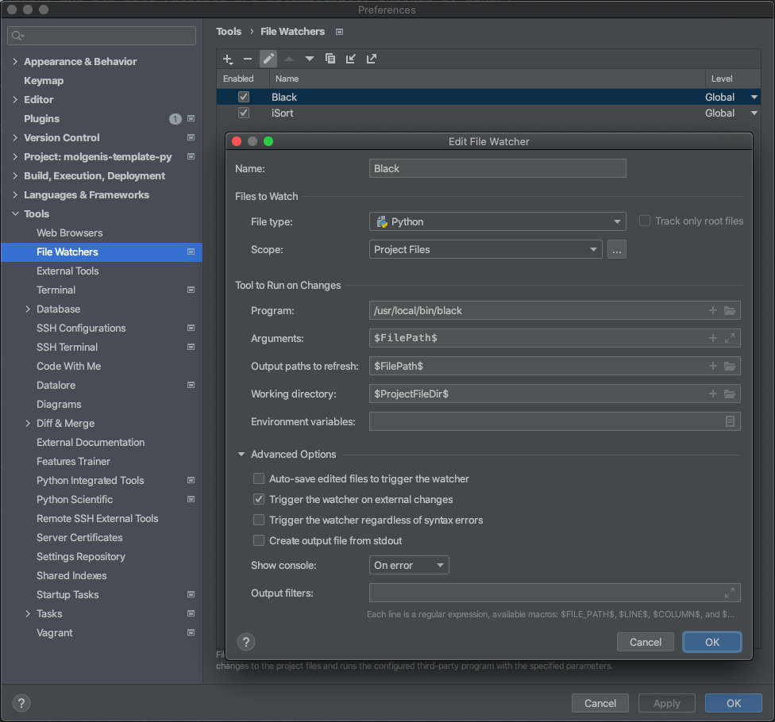
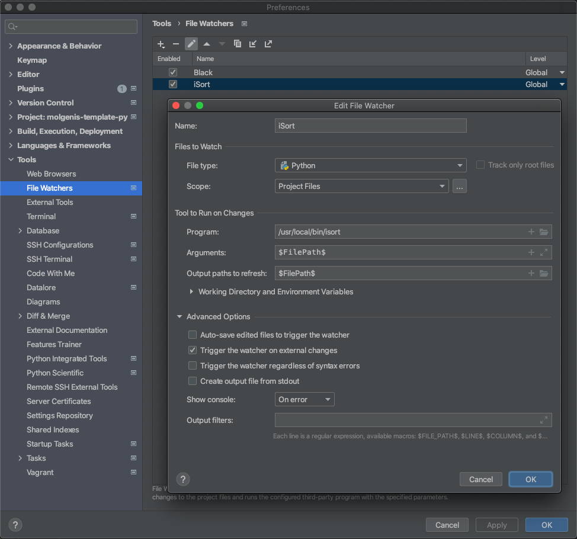

# molgenis-template-py
A template with boilerplate and pre-made configuration for Python projects

## How to use
1. Click on the "Use this template" button and name your repo
2. Fork it and clone it locally
3. In your favorite IDE:
   * Search for all occurrences of `<#CHANGE-ME#>` and replace them individually with something sensible
   * Search for all occurrences of `<#REPO-NAME#>` and replace them all with the name of your new repo (e.g. `molgenis-py-foo`)
   * Rename (refactor) the package `src/molgenis/PROJECT` to your project's name (e.g. `src/molgenis/foo`)
   * Search for `<#PACKAGE-NAME#>` and replace it with the name you gave the package in the previous step
   * Rename `RENAME-Jenkinsfile` to `Jenkinsfile` to activate the build pipeline
4. The `example.py` file under the `src` folder contains an example of how to set up the
entry points of your library, application or command-line interface. You can use it as
a starting point, or you can safely remove it. It's up to you!
5. Remove/edit this file :)

## PyScaffold
This project has been set up with PyScaffold 4.1.1. To know more about the standards and
best practices it configures, read [the documentation](https://pyscaffold.org/). Here are
some key points:
- All the configuration for your project should go in `setup.cfg`
- Development is done in a virtual environment. We use [pipenv](https://pipenv.pypa.io/en/latest/).
- Developer dependencies should be added to the `Pipfile` (with `pipenv install --dev <package>`),
  normal dependencies should go in `setup.cfg`. `pipenv` will automatically pick these
  up when developing.
- You can use `tox` to build your project and run tests. Just run `tox` to run all tests.
  Take a look at `tox.ini` for the possibilities.
- Code styles are enforced at commit-time. Developers that have not installed the `pre-commit` hooks
will probably see their pull request build fail, so make sure to make that clear to them.
  There are developer instructions that you can use in your README further below. The
  actual checks are configured in `.pre-commit-config.yaml`.

## Other info
Here's some other useful information:
- By default, the project is configured to use Python 3.6. This can be changed in `setup.cfg`
- A build pipeline for Jenkins is added. If you want to add your own build pipeline,
feel free to put up a pull request!
- The Jenkinsfile contains a release flow that uses `tox` to build and release to PyPi.
  The release can be triggered on Jenkins. A build is first published to TestPyPi, where
  you can try out the release before committing to the real thing.
- Your repository and its pull requests are automatically checked by Sonar.


## Docs below this part can be used in your own README:


## For developers
This project uses [pre-commit](https://pre-commit.com/) and [pipenv](https://pypi.org/project/pipenv/)
for the development workflow.

Install pre-commit and pipenv if you haven't already:
```
pip install pre-commit
pip install pipenv
```

Clone or check out this repository with git and install the git commit hooks:
```
pre-commit install
```

Create an environment and install the package including all (dev) dependencies:
```
pipenv install
```

Activate the virtual environment:
```
pipenv shell
```

Build and run the tests:
```
tox
```

>Note: If you want automatic code formatting in your IDE, you need to configure file watchers
  for `black` (the code formatter) and `isort` (the formatter for import statements). Here
  are some examples of how to configure them in `PyCharm`:
>
> 
> 
